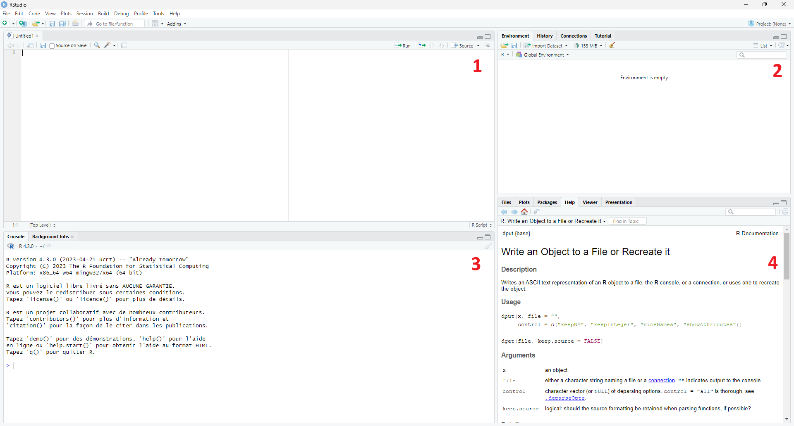
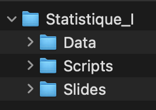
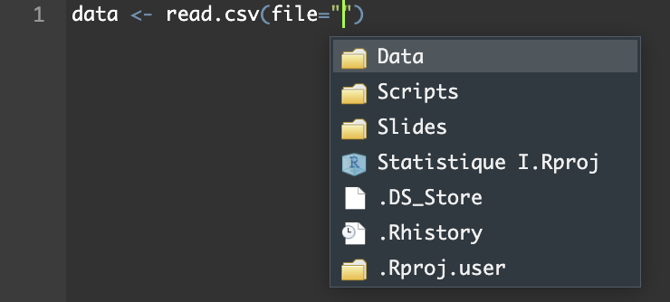

# Installation et environnement R et Rstudio

## Présentation des logiciels

R est un langage de programmation adapté au traitement de données et à l'analyse statistique.

Pour programmer en langage R, il est nécessaire d'installer deux outils essentiels:

1.  Le **langage R** permet de traduire des commandes en instructions pour l'ordinateur.
2.  Le **logiciel RStudio** permet de faciliter l'utilisation du logiciel R en donnant l'accès à une interface utilisateur.

Il est possible de faire une analogie avec une voiture. Le logiciel R est le moteur et RStudio est le tableau de bord. Sans le tableau de bord, il n'est pas possible de controler le moteur.

## Installation

1.  Installer R sur le site de R.
    i.  Choisir et télécharger la version de R selon votre système d'exploitation.
        -   Pour windows : <https://cran.r-project.org/bin/windows/base/>
        -   Pour MAC : <https://cran.r-project.org/bin/macosx/>
        -   Pour Linux : <https://cran.r-project.org/index.html>
    ii. Installer le logiciel R sur votre ordinateur en exécutant le fichier téléchargé.
2.  Installer RStudio sur le site suivant: <https://posit.co/download/rstudio-desktop/>

Après avoir installé ces deux logiciels, vous aurez accès à deux nouvelles applications. Cependant, nous utiliserons uniquement RStudio pour programmer. Lorsque vous exécuterez votre code écrit sur RStudio, ce dernier fera automatiquement appel à R pour exécuter les codes.

## Installation et gestion des packages

Les packages sont des regroupements de fonctions et de jeux de données développés dans R et qui doivent se télécharger une seule fois, mais ils devront être importés à chaque utilisation. Le code ci-dessous permet d'installer le package ggplot2:

```{r eval=FALSE}

install.packages("ggplot2", dependencies = TRUE)#Remplacer ggplot2 par le package requis

```

A chaque ouverture de Rstudio il est nécessaire d'importer le package (si besoin du package au cours de la session) grâce au code suivant:

```{r eval=FALSE}

library(ggplot2)#idem

```


## Environnement de travail

Une fois que RStudio est lancé, une interface découpée en plusieurs zones se présente. Ces parties parties peuvent être redimensionnées, masquées ou maximisées selon vos préférences.

```{r echo=FALSE}

```

Chacune des quatre zones a sa propre utilité:

1.  Cette zone est dédiée aux fichiers sources. Ce volet permet d'écrire et de sauvegarder les lignes de code. Ce sera la partie la plus utilisée lors de la programmation. Un nouveau script peut être ouvert à partir de l'onglet `File` en haut à gauche de l'écran, puis `New File` et `R Script`. Chaque script peut être enregistré soit via le même onglet en choisissant `Save As`, soit en utilisant les raccourcis classiques de votre clavier.
2.  Cette zone fournit des informations sur les objets, les variables et les données en mémoire sous l'onglet `Environment`.
3.  La console est affichée en bas à gauche. Cette partie permet d'entrer et d'exécuter des instructions et voir les résultats s'afficher.
4.  Cette zone permet de naviguer dans le répertoire de travail dans l'onglet `Files`, d'afficher les graphes réalisés dans l'onglet `Plots`, d'afficher les extensions/packages disponibles sous l'onglet `Packages` et également d'afficher l'aide (qui est très complète) sous l'onglet `Help`.


## Organiser ses fichiers

Afin de gérer vos scripts et vos bases de données, nous vous proposons d'organiser vos fichiers au sein de dossiers étiquetés.

Vous pourriez par exemple créer un dossier "Statistique_I" et soit y placer tous vos fichiers (jeux de données, scripts) dont vous avez besoin pour le cours, ou faire des sous-dossier pour chaque thème. Vous pourriez, par exemple, suivre la structure suivante :

<center>

```{r echo=FALSE}

```

</center>

Attention, si vous manquez d'assiduité dans votre organisation, vous allez multiplier les possibilités de mauvaises manipulations.


## Répertoire de travail

Lorsque vous travaillez dans R studio, le logiciel a besoin de savoir quel est votre répertoire de travail (ou working directory en anglais). Si vous ne le spécifiez pas vous-même, R studio va simplement en choisir un par défaut.

Afin de connaître le répertoire de travail actuel, vous pouvez utiliser la fonction *getwd( )*

``` r
getwd()
```

Nous vous conseillons de définir vous-même le répertoire de travail à chaque fois que vous commencez de travailler dans R, par exemple, en le spécifiant au début de vote script.

Si vous avez créé un dossier pour le cours, alors vous pouvez l'utiliser comme répertoire de travail. Cela a de nombreux avantages et notamment vous permet d'accéder facilement aux bases de données.

Pour définir ce répertoire de travail nous vous conseillons l'utilisation de la commande *setwd( )*. Elle vous permet de définir le répertoire de travail. Une bonne pratique consiste à l'indiquer au début du script si vous travaillez avec un script.

A chaque fois que vous retournez sur R studio, vous devrez spécifier votre répertoire de travail.

Pour ce faire, il suffit de copier le chemin qui mène au répertoire de travail à l'intérieur des parenthèses, comme dans l'exemple ci-dessous (remplacez ici "~/Documents/Statistique_I" par le chemin vers votre dossier et enlever les # au début des commandes):
```{r echo=FALSE}
#setwd("~/Documents/Statistique_I")
#getwd()
```


*RAPPEL, vous pouvez obtenir le chemin d'un dossier de la manière suivante:*

- *__Recommandé__: pour la plupart de vos ordinateurs il suffit de 1) cliquer une fois sur un dossier (ou poser la souris) que vous voulez utiliser, 2) d'appuyer sur ctrl+c (ou command + c sur mac), et 3) d'appuyer sur ctrl+v (ou command + v) directement dans votre script Rstudio (quadrant en haut, à gauche)*
- *Sinon, pour windows : [Obtain file path in windows 10](https://www.supportyourtech.com/articles/how-to-get-file-path-windows-10-easy-steps-to-find-your-file-locations/)*

-   *Sinon, pour MAC : [Obtain file path on a Mac](https://macpaw.com/how-to/get-file-path-mac)*

-   *Sinon, pour linux : [Obtain file path in Linux command line](https://linuxhandbook.com/get-file-path/){.uri}*

*Dans certains rare cas vous aurez à inverser les slashs "/" par des antislash "\"*

Une fois que vous avez indiqué votre répertoire de travail par la fonction *setwd( )*, si vous avez une base de données dans le répertoire de travail, vous pourrez y accéder directement.


Exemple 1 :

``` r
# Par exemple, importer le fichier "data_ex1.csv", 
# enregistré dans le répertoire de travail.
read.csv(file="data_ex1.csv")
```

Exemple 2 :

``` r

# Par exemple, importer le fichier "data_ex1.csv", 
# enregistré dans le dossier Data qui se trouve dans le répertoire de travail.
read.csv(file="Data/data_ex1.csv")
```

*Pour rappel, lorsque vous allez indiquer le chemin menant à un fichier, vous pouvez utiliser la touche 'tab' afin que Rstudio vous propose les différentes alternatives à votre disposition. Choisissez votre étape en cliquant dessus. La touche 'tab' peut être réutilisée jusqu'à ce que vous arriviez au fichier de votre choix. Cela vous permet d'éviter toute forme de fausse manipulation telle qu'une faute de frappe par exemple.*

<center>

```{r echo=FALSE}

```

</center>


